<div align="center">

# 🚀 Release Automation

**Multi-repo release orchestration for GitHub, powered entirely by `workflow_dispatch`.**

Scaffold repos → cut release branches → tag & publish releases → fan out CI/CD — all from one control-plane repo.


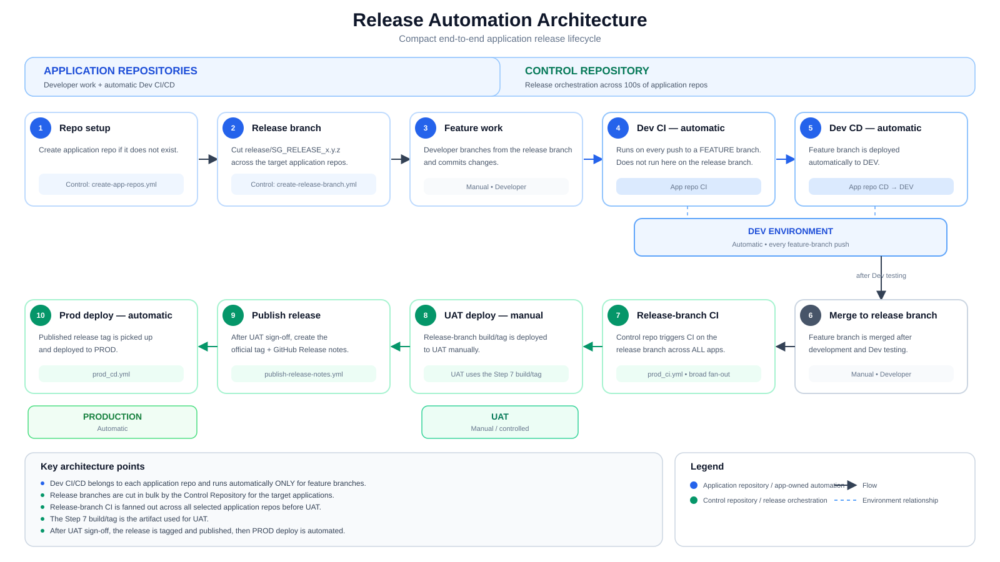
<!-- ☝️ Architecture diagram: control repo → GitHub API → application repos → releases/deploys, plus the dashboard flow -->

</div>

---

## Why this exists

Rolling out a release across several repos usually means repeating the same manual steps — branch, tag, changelog, release, deploy — once per repo, every time. This repo turns that into five push-button workflows that take multi-repo input and do it consistently, failing loudly the moment something looks wrong.

## How a release flows

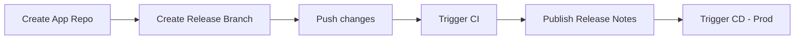

Each box below is its own `workflow_dispatch` job — trigger them manually, in order, from the **Actions** tab.

## The workflows

| # | Workflow | What it does | Key inputs |
|---|----------|---------------|------------|
| 1 | [`create-app-repos.yml`](.github/workflows/create-app-repos.yml) | Scaffolds new Spring Boot + Helm repos from a template | `repo_names`, `description` |
| 2 | [`create-release-branch.yml`](.github/workflows/create-release-branch.yml) | Cuts `release/<name>_<version>` in each target repo | `release_name`, `version`, `app_repos` |
| 3 | [`publish-release-notes.yml`](.github/workflows/publish-release-notes.yml) | Tags the release commit, generates & publishes GitHub Release notes | `release_branch`, `repo_tags` |
| 4 | [`prod_ci.yml`](.github/workflows/prod_ci.yml) | Remotely triggers the `CI` workflow in each app repo | `branch`, `repositories` |
| 5 | [`prod_cd.yml`](.github/workflows/prod_cd.yml) | Remotely triggers the `CD - Prod` workflow, per-repo image tag | `release_branch`, `repo_tags` |
| 6 | [`dashboard.yml`](.github/workflows/dashboard.yml) | Builds a status dashboard and publishes it to GitHub Pages | *(none — runs on a schedule)* |

> 📌 **The five release workflows above take repos as plain `workflow_dispatch` inputs — no files to edit or commit before a run.** The dashboard is the odd one out: it runs itself.

#### 1️⃣ Create App Repo
Scaffolds new Spring Boot + Helm repos from a template.

[](.github/workflows/create-app-repos.yml)
[](https://github.com/saghosh8/release-automation/actions/workflows/create-app-repos.yml)

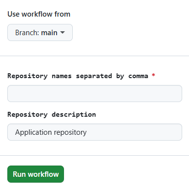

---

#### 2️⃣ Create Release Branch
Cuts `release/<name>_<version>` in each target repo.

[](.github/workflows/create-release-branch.yml)
[](https://github.com/saghosh8/release-automation/actions/workflows/create-release-branch.yml)

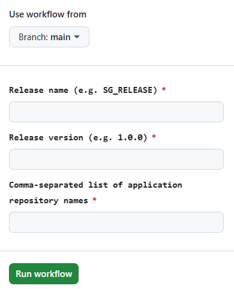

---

#### 3️⃣ Publish Release Notes
Tags the release commit, generates & publishes GitHub Release notes.

[](.github/workflows/publish-release-notes.yml)
[](https://github.com/saghosh8/release-automation/actions/workflows/publish-release-notes.yml)

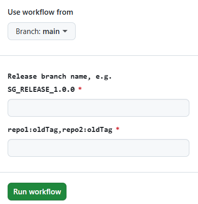

---

#### 4️⃣ Trigger CI
Remotely triggers the `CI` workflow in each app repo.

[](.github/workflows/prod_ci.yml)
[](https://github.com/saghosh8/release-automation/actions/workflows/prod_ci.yml)

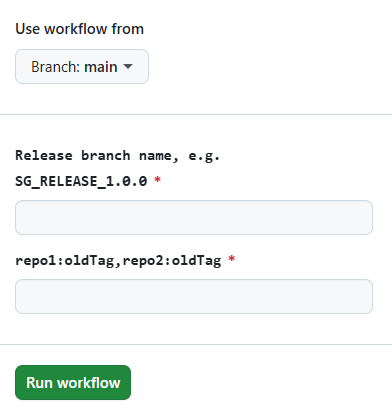

---

#### 5️⃣ Trigger CD - Prod
Remotely triggers the `CD - Prod` workflow, per-repo image tag.

[](.github/workflows/prod_cd.yml)
[](https://github.com/saghosh8/release-automation/actions/workflows/prod_cd.yml)

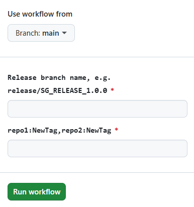

---

#### 6️⃣ Build Dashboard
Builds a status dashboard and publishes it to GitHub Pages — runs on a schedule, no inputs needed.

[](.github/workflows/dashboard.yml)
[](https://github.com/saghosh8/release-automation/actions/workflows/dashboard.yml)

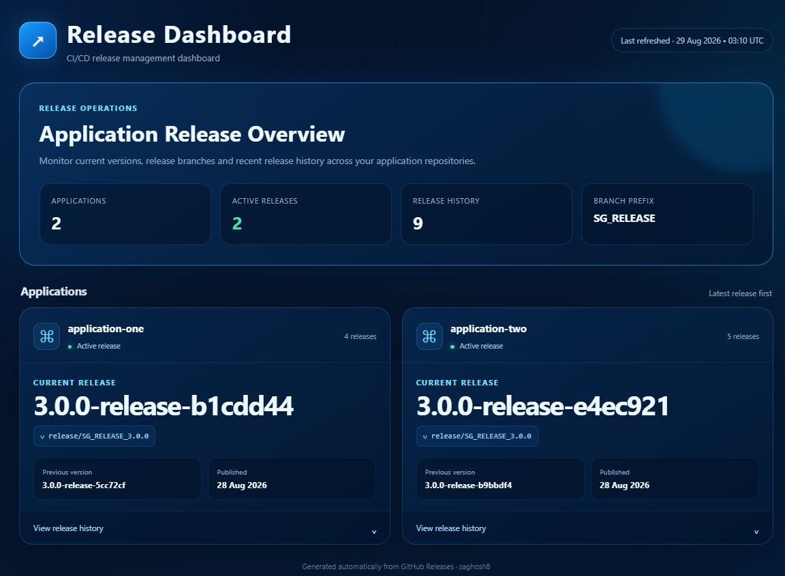

## Quick start

```text
1. Create the repo(s)
   repo_names: application-one,application-two

2. Cut the release branch
   release_name: SG_RELEASE
   version: 1.0.0
   app_repos: application-one,application-two

3. Push your changes to the release branch

4. Trigger CI
   branch: release/SG_RELEASE_1.0.0
   repositories: application-one,application-two

5. Publish the release
   release_branch: SG_RELEASE_1.0.0
   repo_tags: application-one:0.9.0-release-cfb154b,application-two:0.8.2-release-1a2b3c4

6. Deploy to prod
   release_branch: release/SG_RELEASE_1.0.0
   repo_tags: application-one:1.0.0-release-abc1234,application-two:1.0.0-release-81269a6
```

`repo_tags` is always `repo:tag,repo:tag,...` — spaces after commas are fine.

## 📊 Live dashboard

[`dashboard.yml`](.github/workflows/dashboard.yml) keeps a status page published on **GitHub Pages**, no manual trigger needed:

| Trigger | Behavior |
|---|---|
| `schedule` | Runs every 15 minutes (`*/15 * * * *`) |
| `push` to `main` | Rebuilds immediately after any change lands |
| `workflow_dispatch` | Rebuild on demand from the Actions tab |

What it does:

1. Checks out the repo and sets up Python 3.11.
2. Runs `generate_dashboard.py` (with `OWNER` set to the repo owner) to render the dashboard as static HTML.
3. Uploads and deploys that HTML to GitHub Pages via `actions/upload-pages-artifact` + `actions/deploy-pages`.

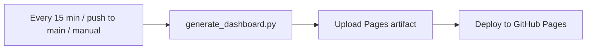

Because it rebuilds on a timer, the dashboard always reflects fresh data pulled via the GitHub API — no one has to remember to refresh it after a release.

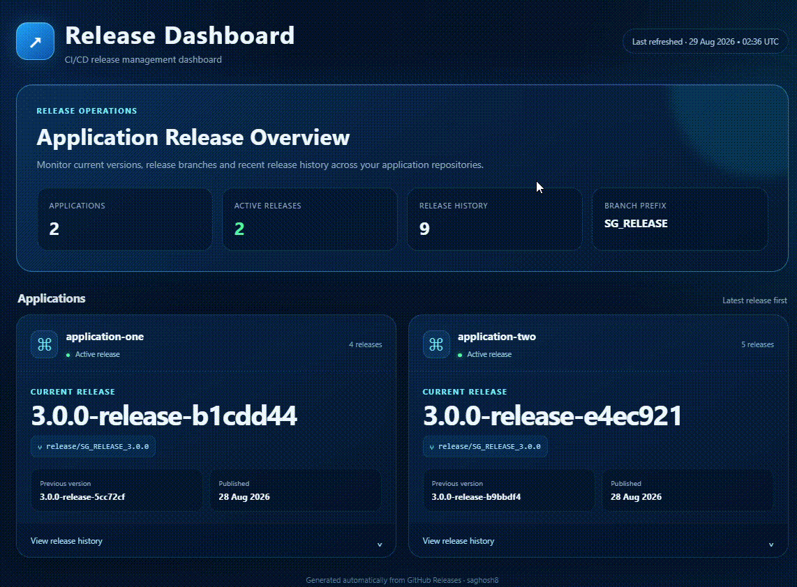

> ℹ️ Exact content shown on the dashboard depends on `generate_dashboard.py` (not covered above). If you want that documented here too, share the script and I'll add a "what you'll see" breakdown.

**One-time setup:** enable Pages under *Settings → Pages → Build and deployment → Source: GitHub Actions*, since `dashboard.yml` deploys via the Pages API (`permissions: pages: write`, `id-token: write`) rather than pushing to a `gh-pages` branch.

## Naming conventions

| Concept | Example |
|---|---|
| Release identifier (input) | `SG_RELEASE_1.0.0` |
| Release branch | `release/SG_RELEASE_1.0.0` |
| Short commit SHA | `81269a6` |
| Release tag | `1.0.0-release-81269a6` |

The release identifier **must** match `SG_RELEASE_<major>.<minor>.<patch>` — anything else fails validation immediately.

## Setup

1. Create a secret named **`RELEASE_AUTOMATION_TOKEN`** under *Settings → Secrets and variables → Actions*.
2. The token needs:
   - Access to every target application repo
   - Permission to create new repos under the owning account
3. Never hard-code the token in a workflow file.

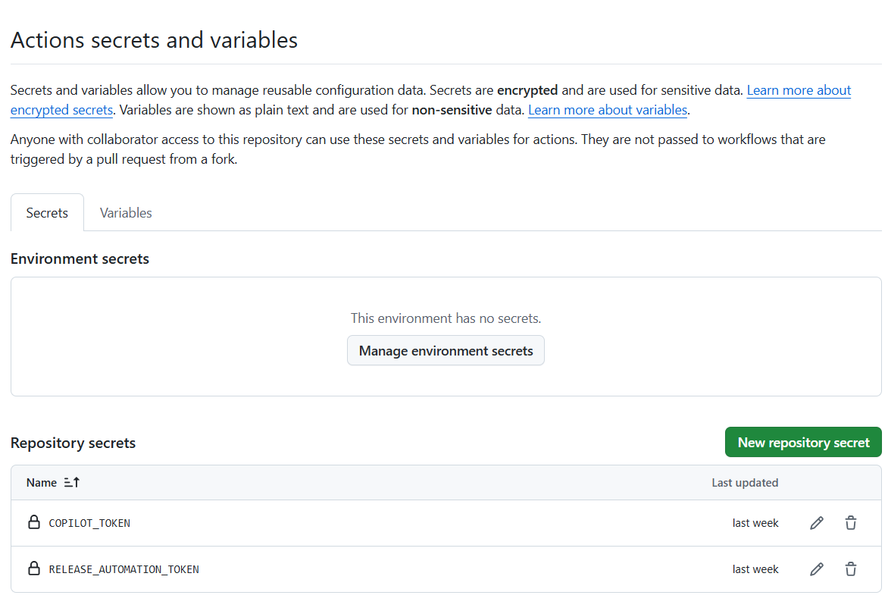

<details>
<summary><strong>Project structure</strong></summary>

```
release-automation/
├── .github/workflows/
│   ├── create-app-repos.yml
│   ├── create-release-branch.yml
│   ├── publish-release-notes.yml
│   ├── prod_ci.yml
│   └── prod_cd.yml
├── input_files/
│   └── app_config.yaml     # template used by create-app-repos.yml
├── README.md
└── LICENSE
```

</details>

<details>
<summary><strong>How <code>create-app-repos.yml</code> derives Java naming</strong></summary>

`APP_NAME` always comes from the repository name being created — never from config — so a shared `app_config.yaml` still produces correctly named code per repo.

| Placeholder | Rule | `billing-service` → |
|---|---|---|
| `${JAVA_PACKAGE}` | dots, no hyphens | `com.example.billingservice` |
| `${JAVA_PACKAGE_PATH}` | same, as a path | `com/example/billingservice` |
| `${JAVA_CLASS_NAME}` | PascalCase + `Application` | `BillingServiceApplication` |

Generated repos include a full Spring Boot skeleton, per-environment profiles, a `Dockerfile`, and a Helm chart with per-environment values files.

</details>

<details>
<summary><strong>Failure handling</strong></summary>

Every workflow runs with `set -euo pipefail` and fails fast on things like:

- Target repo already exists (won't overwrite) · doesn't exist · isn't accessible
- `release_branch` doesn't match `SG_RELEASE_<x.y.z>`
- `repo_tags` is empty, malformed, or missing a tag for a repo
- Release branch or old/new tag doesn't exist
- Existing release tag points to the wrong commit
- Zero commits between old and new release
- Target `CI` / `CD - Prod` workflow not found by exact name in the app repo

Errors always name the affected repo and branch/tag.

</details>

<details>
<summary><strong>Troubleshooting</strong></summary>

| Symptom | Check |
|---|---|
| `release_branch` rejected | Must be exactly `SG_RELEASE_<major>.<minor>.<patch>` |
| Repo not found | Name is correct, repo exists, token has access |
| Release branch not found | `SG_RELEASE_1.0.0` → expects `release/SG_RELEASE_1.0.0` to already exist |
| Tag exists, different commit | Workflow won't move it — inspect manually before proceeding |
| `repo_tags` errors | Format is `repo:tag,repo:tag`; every repo needs a non-empty tag |
| `CI` / `CD - Prod` not found | Target repo needs a workflow whose `name:` field is exactly `CI` or `CD - Prod` |

</details>

## Security notes

- Secret-only token, never committed
- Minimum required, ideally fine-grained, repo-scoped permissions
- No credentials printed in logs
- Existing tags and repos are never silently overwritten

## Contributing

```bash
git checkout -b feature/improvement
# make changes, test the workflows
git commit -m "Add release automation improvement"
git push origin feature/improvement
```

Then open a PR.

## License

MIT — see [`LICENSE`](LICENSE).
